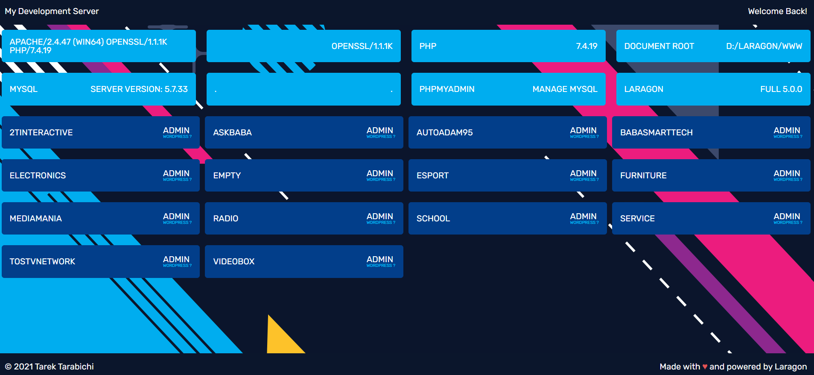

# Index-for-Laragon
Laragon Server index page

Welcome to the Laragon root directory index page!

We've created a visually appealing user interface that will auto sense any projects and directories created within the root page of your XAMPP server. Our index file replaces the vanilla Laragon server index page, providing you with a more interactive and efficient way to manage your projects.

With our customized UI, you can easily navigate through your projects and directories, quickly find the files you need, and manage your server more effectively. We understand the importance of having an organized workspace, and our index page helps you achieve just that.

Our index page is designed to be user-friendly and intuitive, making it easy for beginners and experienced developers alike. We've incorporated a responsive design, so you can access it on any device, whether you're on your desktop computer or mobile phone.

We're confident that our Laragon root directory index page will enhance your development experience and streamline your workflow. Try it out today and let us know what you think!

make sure you change your development path (.test)
