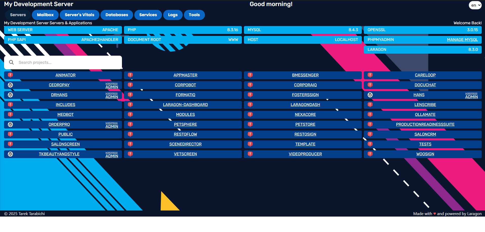

#   Laragon Dashboard  

# Welcome to the Laragon Dashboard ! 

Attention developers!Are you tired of sifting through a cluttered directory to find your projects and files? Look no further than our customized user interface designed specifically for your Laragon server.

🚀 Pros & Devs love [Laragon](https://laragon.org) and for sure will love our [laragon Dashboard](https://github.com/LebToki/Laragon-Dashboard) since the combination of that stack makes it unbeatable!

 

 
Our UI automatically detects any projects and directories within your root directory, making it easy to manage your work. Plus, we've included an automated auto-detection for popular frameworks like WordPress, Laravel, and Symfony. We've gone the extra mile to provide a visually appealing and intuitive interface that's easy to navigate, so you can spend more time coding and less time searching for files. And with a responsive design, you can access our UI on any device.

#   Key Features

| Clean and Modern Design | Efficient Management |   Seamless on Any Device | Auto-Detection |  
|--------------------------------------------------------------------------------------------------------------|-------------------------------------------------------------------------------------------------------------------------|----------------------------------------------------------------------------------------------------------------------|------------------------------------------------------------------------------------------------------------------------|
| Provides a clean and modern design that is both easy on the eyes and easy to navigate. | Automated auto-detection for popular frameworks like WordPress, Laravel, and Symfony. | Designed to work seamlessly on any device, from desktop computers to mobile phones.   | Automated auto-detection for popular frameworks like WordPress, Laravel, and Symfony.                                     

 

> Note: bigger better features coming soon just waiting for the next release of Laragon

 

#   How to use

1. Replace the default index.php file in your Laragon root directory with our customized index.php file.
2. Change your development path (.local) if you've named your path differently.
3. Upload the icons and CSS files to the assets directory (or simply import them as is).
4. Change the ignored directories or add the directories that you don't intend to expose publicly.

#   Feedback
- We're confident that our dashboard will enhance your development experience and streamline your workflow. Try it out today and let us know what you think! Join the discussions and let's make Laragon Dashboard the best it can be.
- Don't forget to star the project to stay up-to-date on future improvements, and please share your feedback with us. We're always looking for ways to make our dashboard even better for you.

#   Changelog
### What's New in 3.3.3 · May 31, 2024 
(major release re-written ground-up with languages support, mailbox and stack's Vitals )

**Introduced Language Translation Support**
- Implemented language translation support using JSON files.
- Fixed (de, en, es, fr, pt and tl for now)

**Introduced Breadcrumbs and Tabs:**
Introduced breadcrumb headers for each tab for better navigation.

These tabs are now in place:
- Servers Tab
- Mailbox Tab
- Server or Stack Vitals

**Other Updates and Improvements**

- HTML Structure:
Refactored HTML structure to include header for each tab within the tab content.
Updated navigation tabs to include servers, mailbox, and vitals.
- CSS Styling:
Improved overall styling with Bootstrap 5.
Added custom styles for tabs, headers, and overview cards.
- JavaScript Functionality:
Enhanced tab switching functionality with jQuery.
Added language selector change event to reload the page with the selected language.
- PHP Code Enhancements:
Refactored server information retrieval and display logic.
Enhanced error handling for server vitals data retrieval.

📢️ Thanks everyone for your support and words of love for Laragon Dashboard, I am committed to creating the best Stack Dashboard to support the ever growing community of Laragon

Changes in Version 2.2.1

- Improved Error Handling and Security:
- Enhanced handleQueryParameter function with input validation and escaping of outputs to prevent XSS attacks.

**Updates and Enhancements:**
- Improved getServerExtensions function to handle Apache modules correctly.
- Updated getPhpVersion function to retrieve the latest PHP version from the official PHP website.
- Improved getSQLVersion function to handle MySQL version retrieval correctly.
- Enhanced getLocalSites function to ignore specific directories and files.
- Updated renderLinks function to prevent XSS attacks.
- Improved getSiteDir function to handle server software detection correctly.
- Removed the check for wp-admin when detecting Laravel.
- Removed the "Admin" link from the HTML output for Laravel applications.

Changes in Version 2.2

**Code Organization**
Separation of Concerns: Functions related to server status, PHP version checks, and other utilities have been suggested to be moved to separate files, enhancing maintainability and readability.

**Error Handling**
Robust Error Management: Enhanced error handling across the script, including the use of try-catch blocks for operations prone to failure, such as file access and external API calls.
Database Connection Handling: Improved the management of database connections by introducing exception handling to gracefully manage connection errors and prevent the application from crashing.

**Security Enhancements**
Input Sanitization: Strengthened the sanitization and validation of user inputs and external data manipulations, especially in URLs, file paths, and database queries, to prevent security vulnerabilities like SQL injection and XSS.
Sensitive Information: Increased caution around the display of sensitive information, ensuring that debugging and sensitive data are not exposed in the production environment.

**Performance Considerations**
Data Caching: Introduced caching strategies for frequently accessed data that doesn't change often, reducing the load on the server and speeding up response times.
Lazy Loading: Recommended lazy loading for non-critical resources to improve initial page load times.

**Front-end Enhancements**
JavaScript Graceful Degradation: Ensured that essential functionalities of the web application do not rely solely on JavaScript and work even when JavaScript is disabled.

**Accessibility and Usability**
WCAG Compliance: Improved accessibility by ensuring that the user interface complies with WCAG guidelines, including screen reader support, keyboard navigability, and proper contrast ratios.
Alt Attributes: Added alt attributes to all images for better accessibility.

**Responsive Design**
Ensured that the web application's layout is responsive and performs well across different devices using media queries.

**Modern PHP Features**
PHP 7.4 + Features: Leveraged modern PHP features such as typed properties, arrow functions, and null coalescing assignment operators where appropriate.

**Specific Code Refactoring**
These updates collectively enhance the security, performance, maintainability, and user experience of your Laragon server index page.

Changes in Version 2.1.5

ecurity: Added input validation and output escaping to prevent XSS and other security vulnerabilities.
Error Handling: Improved error handling with try-catch blocks and better error checking for file operations.
Readability: Refactored some functions for better readability and maintainability.
Modularity: Made the code more modular and easy to extend or modify.

Changes in Version 2.1.3

-Added Python based project detection case: The switch case for detecting Python based projects has been implemented, allowing the system to recognize Python projects within the Laragon root directory. This enables specific handling and customization for Python projects.

-Added Python project icon to the assets: A new icon representing Python projects has been added to the assets directory. This icon enhances the visual representation and differentiation of Python projects within the Laragon Server Index Page.

Changes in Version 2.1.2

- Updated UI for enhanced user experience: The user interface of the Laragon Server Index Page has been refined with improved styling, layout adjustments, and optimized visual elements. These enhancements aim to provide a more user-friendly and visually appealing experience for developers.

-Performance optimizations: Several optimizations have been implemented to improve the overall performance and loading speed of the Laragon Server Index Page. These optimizations ensure faster navigation and smoother interactions within the index page.

Changes in Version 1.2.0

- Updated UI for enhanced user experience: The user interface of the Laragon Server Index Page has been refined with improved styling, layout adjustments, and optimized visual elements. These enhancements aim to provide a more user-friendly and visually appealing experience for developers.
-Performance optimizations: Several optimizations have been implemented to improve the overall performance and loading speed of the Laragon Server Index Page. These optimizations ensure faster navigation and smoother interactions within the index page.
- Improved framework detection: The framework detection algorithm has been enhanced to automatically detect popular frameworks such as Laravel, Symfony, and WordPress within the Laragon root directory. This results in more accurate identification and tailored handling of framework-specific projects.

Changes in Version 1.1.0

- Initial release: The Laragon Server Index Page was initially introduced, providing a user-friendly and efficient interface for managing projects within the Laragon server environment. The index page included features like project visualization, basic file operations, and framework detection for Laravel.

For full details and former releases, check out the [changelog](changelog.md).

 
And don't worry, we've taken care of cleaning up all PHP calls, providing error responses, and removing redundant codes.

This is good enough to be the official index page of Laragon to replace the vanilla Laragon server index page, and offers several key features that make it an essential tool for developers:

Stay ahead of the curve with Laragon Dashboard and connect with me and with the other contributors of the Laragon Dashboard project. We now support language files so feel free to contribute and send us your translations to include them in the next upcoming releases.

We're confident that our dashboard will enhance your development experience and streamline your workflow. Try it out today and let us know what you think!

Don't forget to star the project to stay up-to-date on future improvements, and please share your feedback with us. We're always looking for ways to make our index page even better for you.

 

#   Get Involved

Whether you're a developer, system integrator, or enterprise user, you can trust that we did everything possible to make it as smooth and easy as 1,2,3 to set up our laragon Dashboard.

- [ ] ⭐ **Give us a star** on GitHub 👆
- [ ] ⭐ **Fork the project** on GitHub and contribute👆
- [ ] 🚀 **Do you like to code**? You're more than welcome to contribute [_Join the Discussions!_](https://github.com/LebToki/Laragon-Dashboard/discussions) 
- [ ] 💡 Got a feature suggestion? [_Add your roadmap ideas_](https://github.com/LebToki/Laragon-Dashboard/issues)

 

This project is licensed under the Attribution License.

This work by <a rel="cc:attributionURL dct:creator" property="cc:attributionName" href="https://2tinteractive.com">Tarek Tarabichi</a> is licensed under <a href="http://creativecommons.org/licenses/by/4.0/?ref=chooser-v1" target="_blank" rel="license noopener noreferrer" style="display:inline-block;">CC BY 4.0</a>

2023-2024 · Tarek Tarabichi [2tinteractive.com](https://2tinteractive.com) · Made with 💙
