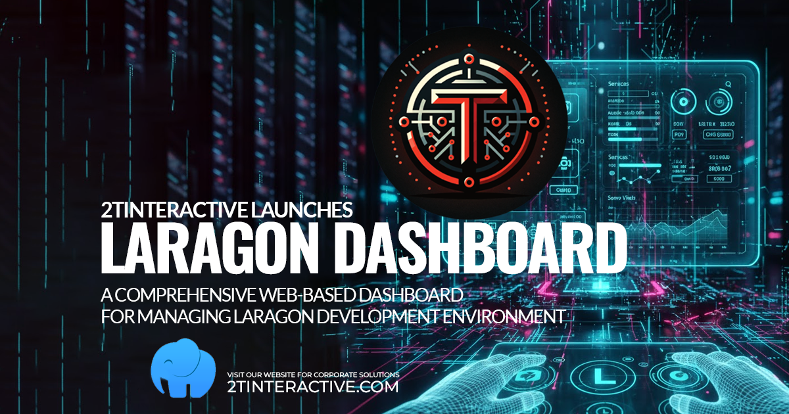

# 🚀 Laragon Dashboard

We're thrilled to announce the release of Laragon Dashboard 4.0.0, a complete reimagining of local development environment management for Windows. This isn't just an update, it's a quantum leap forward in how you interact with your Laragon setup.

Laragon Dashboard is a modern, feature-rich web-based dashboard for managing Laragon development environment. 
Version 4.0.0 aims to be a comprehensive MAMP competitor on Windows, replicating Laragon control panel functionality in a modern, themed web interface.

"The best Windows development environment just got better. Welcome to the future of local development."


[](https://github.com/LebToki/Laragon-Dashboard)
[](https://php.net)
[](https://getbootstrap.com)
[]()
[](LICENSE)
[](https://github.com/LebToki/Laragon-Dashboard)
[](https://buymeacoffee.com/LebToki)
[](https://www.paypal.com/donate/?hosted_button_id=TEEJNYQJA9B6U)

<p align="center">
  
  
  
</p>


---

## ✨ Screenshots


---

## 📋 Project Information

- **Project Name**: Laragon Dashboard
- **Version**: 4.0.0
- **Author**: Tarek Tarabichi
- **Company**: 2TInteractive (2tinteractive.com)
- **Project Start**: Early 2024
- **GitHub**: https://github.com/LebToki/Laragon-Dashboard
- **License**: MIT
- **Goal**: MAMP competitor for Windows OS (with potential future cross-platform support)

---

## 💡 Why This Matters
Laragon has always been the fastest, most lightweight development environment for Windows. With version 4.0.0 of the dashboard, we're bringing that same philosophy to the web interface:

- No Electron bloat – Pure web technology, zero memory overhead
- Instant startup – Dashboard loads in milliseconds
- Native feel – WebSocket updates make it feel like a desktop app
- Extensible – Plugin system for custom tools and integrations

## 🎉 Join the Revolution
This release transforms Laragon from a simple WAMP alternative into a comprehensive development ecosystem that rivals (and surpasses) MAMP on macOS. Whether you're a Laravel artisan, WordPress developer, or Symfony specialist, this dashboard will change how you work.

-> Download now from the official repository or update through Laragon's built-in tools.

---

## 🌍 Platform Support

### Current Status (as of November 2025)
- **Windows**: ✅ Fully supported (primary platform)
- **macOS**: ❌ Not supported by Laragon (Windows-only)
- **Linux**: ❌ Not supported by Laragon (Windows-only)

### Cross-Platform Research
Laragon is currently Windows-only. For future cross-platform support, the dashboard architecture is designed to:
- Abstract platform-specific operations (service management, file paths, etc.)
- Support multiple backend environments (Laragon on Windows, MAMP/XAMPP on macOS/Linux)
- Detect and adapt to the host platform
- Provide platform-specific features when available

**Potential Future Platforms**:
- **macOS**: Could integrate with MAMP, Laravel Valet, or Docker
- **Linux**: Could integrate with LAMP stack, Docker, or platform-specific tools

## ✨ Features

### 🎛️ Service Management
- **Start/Stop/Restart Services** - Apache, MySQL, Nginx, Redis, Memcached, MongoDB, PostgreSQL, Mailpit
- **Service Status Monitoring** - Real-time status display
- **Port Monitoring** - View all listening ports on your system
- **Service Version Detection** - Automatic version detection
- **Windows Service Control** - Full Windows service management via `sc` commands
- **Process-Based Services** - Support for non-Windows services (Nginx, Mailpit)

### 📁 Project Management
- **Project Discovery** - Automatically list projects from `www` directory
- **Framework Detection** - WordPress, Laravel, Drupal, CodeIgniter, Symfony, CakePHP, Joomla
- **Project Search/Filter** - Quick search and filtering capabilities
- **Quick Access Links** - Direct links to project admin panels
- **Framework-Specific Icons** - Visual identification of project types
- **Project Actions Menu** - 3-dot dropdown menu for quick actions (Ignore Project)
- **Smart WP Admin Button** - Only displays for WordPress projects, hides automatically for others
- **Project Ignoring** - Hide projects from the list via dropdown menu or right-click context menu

### 🗄️ Database Management
- **Universal Database Browser** - Browse all databases with real-time size calculations.
- **Table Explorer & Schema Viewer** - Deep-dive into table structures, row counts, indices, and constraints.
- **Safe SQL Query Runner** - Execute SELECT queries with a result grid (Safe Read-Only mode).
- **Engine & Collation Tracking** - Monitor storage engines and character sets at a glance.
- **Modular Backend** - Powered by a high-performance `Databases.php` core class.

### 📧 Email Management (Mailpit)
- **Smart Email Viewer** - Integrated viewer for Laragon's sendmail output.
- **Logs as HTML Rendering** - **NEW**: Automagically transforms raw log emails into searchable, color-coded HTML tables.
- **Mailpit Sync** - Seamless integration with Mailpit for real-time local email monitoring.
- **Email Statistics** - Comprehensive breakdown of email volume and unique senders.
- **Bulk Operations** - Advanced search, filter, and management of local mail.

### 📊 Server Monitoring
- **Real-time Vitals** - CPU, memory, and disk usage monitoring
- **PHP Memory Tracking** - Monitor PHP memory usage and limits
- **Multi-drive Support** - Track disk usage across all drives
- **Visual Charts** - Interactive charts using Chart.js
- **Windows Compatible** - Optimized for Windows/Laragon environment

### 📋 Log Viewer
- **Multi-Log Support** - View Apache, PHP, MySQL, and Dashboard logs
- **Configurable Display** - Adjust number of lines to display (10-1000)
- **Log Management** - Clear log files with one click
- **Auto-Detection** - Automatically finds available log files
- **Terminal-Style Display** - Easy-to-read log format

### 🛠️ Quick Tools
- **Cache Management** - Clear application and framework caches
- **Database Optimization** - Optimize all tables in a database
- **Git Integration** - Check Git status for projects
- **Composer Commands** - Install, update, dump-autoload, clear-cache
- **NPM Commands** - Install, update, run build/dev/prod
- **PHP Info** - Quick access to PHP configuration
- **SMTP Configuration Fix** - Automatically configure PHP to use Mailpit SMTP instead of sendmail.exe

### 💾 Backup & Export
- **Full Project Backup** - Backup projects with database
- **Configurable Options** - Include/exclude vendor, cache directories
- **Recent Backups List** - View and manage backup history
- **Download Backups** - Easy backup retrieval
- **ZIP Compression** - Efficient backup storage

### 🔄 Update Management
- **GitHub-Integrated Updates** - Automatic checks against the latest releases.
- **Visual Progress** - Real-time download and installation feedback.
- **Safety First** - Automated backup of the current installation before any update.

### 🤖 AI Integration (Beta)
- **BYOK AI Agent** - **NEW**: Integrated glassmorphic chat widget for project scaffolding, troubleshooting, and code assistance.
- **System Context Bridge** - Secure backend API providing real-time environment data to the agent.

### 🔒 Security Features
- **CSRF Protection** - Secure token-based protection
- **Security Headers** - Comprehensive HTTP security headers
- **Rate Limiting** - Prevent abuse and brute force attacks
- **Input Sanitization** - XSS and injection protection
- **Secure Sessions** - HTTPOnly and secure cookie settings
- **Content Security Policy** - Advanced CSP implementation
- **SQL Injection Protection** - Prepared statements throughout

### 🌍 Multi-language Support
- **8 Languages** - English, German, Spanish, French, Indonesian, Portuguese, Tagalog, Arabic
- **Easy Language Switching** - Quick language selector
- **Consistent Translation System** - Organized translation files
- **Module-Based Translations** - Translations organized by feature

## 🛠️ Installation

### Prerequisites

- **Laragon** development environment installed
- **PHP 7.4+** with required extensions:
  - `json`
  - `mbstring`
  - `openssl`
  - `pdo_mysql`
- **MySQL/MariaDB** server
- **Web server** (Apache/Nginx)

### Quick Setup

#### Option 1: Download ZIP (Recommended)

1. **Download the latest release** from the [Releases page](https://github.com/LebToki/Laragon-Dashboard/releases)

2. **Extract the zip file** to your Laragon `www` directory:
   ```
   C:\laragon\www\Laragon-Dashboard\
   ```

3. **Edit Laragon's root index.php** (located at `C:\laragon\www\index.php`)
   
   Replace the existing content with this redirect:
   ```php
   <?php
   header('Location: /Laragon-Dashboard/');
   exit;
   ?>
   ```

4. **Access Dashboard**
   ```
   http://localhost/
   ```
   or directly:
   ```
   http://localhost/Laragon-Dashboard/
   ```

#### Option 2: Git Clone

1. **Clone the repository**
   ```bash
   git clone https://github.com/LebToki/Laragon-Dashboard.git
   cd Laragon-Dashboard
   ```

2. **Move to Laragon www directory**
   ```bash
   # Move Laragon-Dashboard folder to www
   move Laragon-Dashboard C:\laragon\www\Laragon-Dashboard
   ```

3. **Edit Laragon's root index.php** (located at `C:\laragon\www\index.php`)
   
   Replace the existing content with this redirect:
   ```php
   <?php
   header('Location: /Laragon-Dashboard/');
   exit;
   ?>
   ```

4. **Access Dashboard**
   ```
   http://localhost/
   ```
   or directly:
   ```
   http://localhost/Laragon-Dashboard/
   ```

### Configuration

The dashboard auto-detects Laragon installation paths. Edit `config.php` to customize:

```php
// Auto-detected values (no manual configuration needed)
$LARAGON_ROOT = getLaragonRoot(); // Auto-detect from common paths
SENDMAIL_OUTPUT_DIR = getLaragonSendmailDir(); // C:/laragon/bin/sendmail/output/
DOMAIN_SUFFIX = getLaragonDomainSuffix(); // .local
APP_VERSION = getAppVersion(); // From Git or VERSION file

// MySQL Configuration (defaults)
MYSQL_HOST = 'localhost'
MYSQL_USER = 'root'
MYSQL_PASSWORD = ''

// Application Settings
APP_NAME = 'Laragon Dashboard'
APP_DEBUG = false  // Debug banner is DISABLED by default (line 38)
APP_ENV = 'production'  // development, staging, production (line 41)
SESSION_TIMEOUT = 3600
MAX_LOGIN_ATTEMPTS = 5

// Time and Date Format (optional overrides)
TIME_FORMAT = null  // null = auto-detect, '12' = 12-hour, '24' = 24-hour
DATE_FORMAT = null  // null = auto-detect, or custom format like 'Y-m-d', 'm/d/Y'
```

**Important Notes:**

- **Debug Banner**: The debug banner is **disabled by default** (`APP_DEBUG = false` on line 38). You won't see it unless you enable it for troubleshooting. Only enable it if you're experiencing CSS loading issues, asset path problems, or need to debug routing/URL issues. You can also enable it via the Preferences page.

- **Environment**: The dashboard runs in `production` mode by default (`APP_ENV = 'production'` on line 41). This ensures optimal performance and security. Change to `development` only if you need additional debugging features.

- **Time/Date Format**: Time and date formats are auto-detected from your system locale. You can override them in `config.php` or via the Preferences page.

**Laragon Path Auto-Detection Order:**
1. `LARAGON_ROOT` environment variable
2. Common paths: `C:/laragon`, `D:/laragon`, `E:/laragon`
3. Detect from `DOCUMENT_ROOT` (if contains 'laragon')
4. Default fallback: `C:/laragon`

**Important Setup Note:**
- The root `index.php` file at `C:\laragon\www\index.php` should redirect to the dashboard
- This allows accessing the dashboard via `http://localhost/` instead of `http://localhost/Laragon-Dashboard/`
- If you prefer direct access, you can skip modifying the root `index.php` and access the dashboard directly at `http://localhost/Laragon-Dashboard/`

## 📁 Project Structure

```
Laragon-Dashboard/
├── api/                    # API endpoints
│   ├── services.php        # Services management API
│   ├── databases.php       # Database management API
│   ├── vitals.php         # Server monitoring API
│   ├── logs.php           # Log viewer API
│   ├── tools.php          # Quick tools API
│   ├── backup.php         # Backup API
│   ├── update.php         # Update API
│   └── mailpit.php        # Email management API
├── assets/                 # Application assets
│   ├── css/               # Stylesheets
│   ├── js/                # JavaScript files
│   ├── images/            # Images and icons
│   └── fonts/             # Web fonts
├── i18n/                  # Internationalization
│   ├── common/            # Common translations
│   ├── dashboard/         # Dashboard translations
│   ├── projects/          # Projects translations
│   └── ...                # Module-specific translations
├── includes/               # Helper classes
│   ├── Router.php         # Routing system
│   ├── UpdateManager.php  # Update management
│   ├── AdminerModule.php  # Database admin integration
│   ├── ConfigMigrator.php # Configuration migration
│   └── helpers.php        # Helper functions
├── pages/                  # Page templates
│   ├── dashboard.php      # Main dashboard
│   ├── projects.php       # Projects page
│   ├── services.php       # Services page
│   ├── databases.php     # Databases page
│   ├── mailbox.php       # Email client
│   ├── vitals.php        # Server monitoring
│   ├── logs.php          # Log viewer
│   └── tools.php         # Quick tools
├── partials/               # Layout partials
│   ├── layouts/          # Layout templates
│   │   ├── layoutTop.php # Top layout (header, sidebar, navbar)
│   │   └── layoutBottom.php # Bottom layout (footer, scripts)
│   ├── head.php          # Meta tags, CSS includes
│   ├── sidebar.php       # Navigation sidebar
│   ├── navbar.php        # Top navigation bar
│   ├── footer.php        # Footer content
│   └── scripts.php       # JavaScript includes
├── devfiles/              # Development files
│   ├── KNOWLEDGE_BASE.md # Knowledge base documentation
│   ├── TESTING_CHECKLIST.md # Testing guidelines
│   └── ...               # Other dev documentation
├── config.php            # Main configuration
├── index.php             # Entry point and router
└── README.md             # This file
```

## 🎯 Usage

### Dashboard Overview

The main dashboard provides:
- **Server Information** - PHP version, MySQL status, web server details
- **Project Management** - List and manage your development projects
- **Framework Detection** - Automatic detection of WordPress, Laravel, Drupal, etc.
- **Quick Access** - Direct links to project admin panels

### Service Management

Control Laragon services via the "Services" tab:
- Start, stop, or restart services (Apache, MySQL, Nginx, Redis, Memcached, MongoDB, PostgreSQL, Mailpit)
- View real-time status of all services
- Monitor listening ports
- Quick service actions

### Project Management

Access projects via the "Projects" tab:
- View all projects in your `www` directory
- Search and filter projects
- See framework detection results
- Quick access to project admin panels

### Database Management

Access database tools via the "Databases" tab:
- Browse all available databases and their sizes
- Explore table structures, row counts, and sizes
- Run SELECT queries safely (read-only)
- Optimize database tables

### Email Management

Access the email client via the "Mailbox" tab:
- View email statistics (total, daily, weekly, unique senders)
- Search and filter emails
- Read full email content
- Delete individual or bulk emails
- Export email data

### Server Monitoring

Monitor your server via the "Server Vitals" tab:
- Real-time charts for CPU, memory, and disk usage
- PHP memory usage tracking
- Multi-drive disk space monitoring
- Performance metrics

### Log Viewer

View logs via the "Logs" tab:
- Multiple log types (Apache, PHP, MySQL, Dashboard)
- Configurable line count (10-1000)
- Clear log files when needed
- Terminal-style display

### Quick Tools

Access developer tools via the "Tools" tab:
- Cache management (clear application and framework caches)
- Database optimization
- Git status check
- Composer and NPM commands
- PHP info viewer

## 🔧 API Endpoints

All APIs return JSON responses and follow a consistent pattern:

### Services API
```
GET /api/services.php?action=status
GET /api/services.php?action=start&service=Apache
GET /api/services.php?action=stop&service=MySQL
GET /api/services.php?action=restart&service=Nginx
GET /api/services.php?action=get_ports
```

### Database API
```
GET /api/databases.php?action=list_databases
GET /api/databases.php?action=get_tables&database=dbname
GET /api/databases.php?action=get_table_structure&database=dbname&table=tablename
GET /api/databases.php?action=get_database_size&database=dbname
POST /api/databases.php?action=execute_query
```

### Server Vitals API
```
GET /api/vitals.php
```
Returns JSON with server statistics (uptime, CPU, memory, disk usage, PHP memory info).

### Log Viewer API
```
GET /api/logs.php?action=list_logs
GET /api/logs.php?action=read_log&path=logpath&lines=100
GET /api/logs.php?action=clear_log&path=logpath
```

### Quick Tools API
```
POST /api/tools.php (action: clear_cache)
POST /api/tools.php (action: optimize_database, database: dbname)
POST /api/tools.php (action: composer_command, project_path: path, command: install)
POST /api/tools.php (action: npm_command, project_path: path, command: install)
POST /api/tools.php (action: git_status, project_path: path)
GET /api/tools.php?action=php_info
```

### Backup API
```
GET /api/backup.php?action=list
POST /api/backup.php?action=create
POST /api/backup.php?action=delete&backup_id=id
```

### Update API
```
GET /api/update.php?action=check
POST /api/update.php?action=download
POST /api/update.php?action=install
```

## 🚀 Production Deployment

### Prerequisites
- PHP 7.4 or higher
- Laravel (or any PHP web server like Apache/Nginx)
- HTTPS enabled (recommended for production)

### Security Configuration

Before deploying to production, please configure the following security settings in `config.php`:

#### 1. Enable Authentication

The dashboard now requires authentication by default. Make sure to set a strong password:

```php
// In config.php
define('AUTH_ENABLED', true);

// Set a strong password (recommended: use environment variable)
define('ADMIN_PASSWORD', getenv('LARAGON_DASHBOARD_PASSWORD') ?: 'YourStrongPassword123!');
```

**Best Practice:** Use environment variables instead of hardcoding passwords:
```bash
# Set environment variable
set LARAGON_DASHBOARD_PASSWORD=YourStrongPassword123!
```

#### 2. Configure HTTPS (Recommended)

Uncomment the HTTPS redirect in `.htaccess`:
```apache
# .htaccess
RewriteCond %{HTTPS} off
RewriteCond %{HTTP:X-Forwarded-Proto} !https
RewriteRule ^(.*)$ https://%{HTTP_HOST}%{REQUEST_URI} [R=301,L]
```

#### 3. Production Settings

The following settings are recommended for production:

```php
// config.php
define('APP_DEBUG', false);        // Disable debug mode
define('APP_ENV', 'production');   // Set environment
define('SECURITY_HEADERS_ENABLED', true);  // Enable security headers
```

### Quick Production Setup

1. **Clone the repository:**
```bash
git clone https://github.com/LebToki/Laragon-Dashboard.git
cd Laragon-Dashboard
```

2. **Checkout production branch:**
```bash
git checkout production
```

3. **Configure security:**
   - Edit `config.php` and set a strong admin password
   - Or set `LARAGON_DASHBOARD_PASSWORD` environment variable

4. **Configure HTTPS:**
   - Uncomment HTTPS redirect in `.htaccess`
   - Or configure SSL in your web server

5. **Access the dashboard:**
   - Navigate to your deployed URL
   - Login with your configured password

### Environment Variables

| Variable | Description | Default |
|----------|-------------|--------|
| `LARAGON_DASHBOARD_PASSWORD` | Admin password | (none - must be set) |
| `LARAGON_ROOT` | Laragon installation path | Auto-detected |

## 🛡️ Security

### Security Features

- **CSRF Protection** - All forms protected with CSRF tokens
- **XSS Prevention** - All user inputs sanitized
- **SQL Injection Protection** - Prepared statements used throughout
- **Rate Limiting** - Prevents brute force attacks
- **Secure Headers** - Comprehensive HTTP security headers
- **File Upload Security** - Restricted file types and sizes

### Security Headers

- `X-Frame-Options: DENY`
- `X-Content-Type-Options: nosniff`
- `X-XSS-Protection: 1; mode=block`
- `Strict-Transport-Security` (HTTPS only)
- `Content-Security-Policy`
- `Referrer-Policy: strict-origin-when-cross-origin`

## 🎨 Customization

### 🎨 Theme System
The dashboard leverages Bootstrap 5's theming capabilities with a custom CSS layer. 
You can easily customize the look and feel by modifying these CSS variables:

```css
/* Main color scheme */
:root {
  --primary-color: #0d6efd;
  --secondary-color: #6c757d;
  --success-color: #198754;
  --danger-color: #dc3545;
  --warning-color: #ffc107;
  --info-color: #0dcaf0;
}

### Language Files

Add new languages by creating JSON files in `i18n/[module]/[language].json`:

```json
{
  "title": "Welcome to the Laragon Dashboard",
  "header": "My Development Server",
  "servers_tab": "Servers",
  "inbox_tab": "Mailbox",
  "vitals_tab": "Server's Vitals"
}
```

## 🐛 Troubleshooting

### Diagnostic Tool

If you're experiencing issues with path detection, CSS loading, or 404 errors, use the built-in diagnostic tool:

1. **Access the diagnostic page**:
   ```
   http://localhost/Laragon-Dashboard/diagnostic.php
   ```
   or
   ```
   http://laragon-dashboard.local/diagnostic.php
   ```

2. **Review the output** - The tool will show:
   - Server configuration and paths
   - Laragon detection status
   - File system checks
   - Asset path verification
   - URL access tests

3. **Share results** - If you need help, share the diagnostic output for faster troubleshooting

### Common Issues

**404 Errors:**
- Run the diagnostic tool to identify path issues
- Verify Apache's document root matches your setup
- Check that `.htaccess` file exists and is readable
- Ensure `index.php` is accessible directly

**CSS/JS Not Loading:**
- Check browser console (F12) for 404 errors on assets
- Verify `ASSETS_URL` is correctly calculated (use diagnostic tool)
- Clear browser cache and hard refresh (Ctrl+F5)
- Ensure assets directory exists and is readable

**Laragon Not Detected:**
- Use the diagnostic tool to verify detection
- Manually set Laragon path in Preferences if auto-detection fails
- Check that `laragon.exe` and `usr/laragon.ini` exist in Laragon root
- Verify file permissions allow PHP to read Laragon directory

**Email not loading:**
- Check `SENDMAIL_OUTPUT_DIR` path in config.php
- Ensure directory exists and is readable
- Verify Laragon sendmail configuration

**Server vitals not working:**
- Ensure PHP has necessary permissions
- Check if required PHP extensions are loaded
- Verify disk paths are accessible

**Database connection issues:**
- Verify MySQL credentials in config.php
- Ensure MySQL service is running
- Check firewall settings

**Performance issues:**
- Enable caching in config.php
- Check log files for errors
- Monitor memory usage

### Debug Banner

**The debug banner is disabled by default** and you won't see it unless you enable it. This is intentional - it's only needed when troubleshooting issues.

**To enable the debug banner:**

1. **Via Preferences** (Recommended):
   - Go to **Preferences** page
   - Under **Debug Settings**, check "Show Debug Banner"
   - Save preferences

2. **Via config.php**:
   ```php
   // In config.php (line 38)
   define('APP_DEBUG', true); // Only enable if troubleshooting
   ```

**When to enable it:**
- If you're experiencing CSS loading issues
- If assets (images, JS, CSS) aren't loading correctly
- If you need to troubleshoot path detection problems
- If you're debugging routing or URL issues

**What it shows:**
- Base URL and Assets URL
- Document root path
- Laragon root detection
- Current script path
- Server variables

**Note**: The debug banner is controlled by `APP_DEBUG` in `config.php` (line 38) and can also be toggled via user preferences. It's set to `false` by default for a clean user experience.

## 📈 Performance

### Optimization Features

- **File-based Caching** - Reduces database queries
- **Lazy Loading** - Loads content as needed
- **Minified Assets** - Optimized CSS and JavaScript
- **Compressed Responses** - Reduced bandwidth usage
- **Database Connection Pooling** - Efficient database usage

### Monitoring

- **Execution Time Tracking** - Monitor page load times
- **Memory Usage Monitoring** - Track memory consumption
- **Cache Statistics** - Monitor cache hit rates
- **Error Logging** - Track and analyze errors

## 🔄 Framework Detection

The dashboard automatically detects frameworks in your projects:

1. **WordPress** - Checks for `wp-config.php`
2. **Laravel** - Checks for `artisan` file
3. **Drupal** - Checks for `sites/default/settings.php`
4. **CodeIgniter** - Checks for `application/config/config.php`
5. **Symfony** - Checks for `app/AppKernel.php` or `symfony.lock`
6. **CakePHP** - Checks for `config/app.php`
7. **Joomla** - Checks for `configuration.php`

## 🤝 Contributing

We welcome contributions! Please see our [Contributing Guidelines](CONTRIBUTING.md) for details.

### Development Setup

1. Fork the repository
2. Create a feature branch
3. Make your changes
4. Add tests if applicable
5. Submit a pull request

### Code Standards

- Follow PSR-12 coding standards
- Add comprehensive comments
- Include error handling
- Test on multiple PHP versions
- No inline JavaScript in PHP files (all JS in separate files)
- Use template partials for layout consistency

## 📄 License

This project is licensed under the MIT License - see the [LICENSE](LICENSE) file for details.

## 🙏 Acknowledgments

- **Laragon Team** - For the excellent development environment
- **Bootstrap Team** - For the amazing CSS framework
- **Chart.js Team** - For the beautiful charting library
- **Contributors** - All the amazing people who contributed to this project

## 📞 Support

- **Documentation** - Check this README and the [Knowledge Base](devfiles/KNOWLEDGE_BASE.md)
- **Issues** - Report bugs via [GitHub Issues](https://github.com/LebToki/Laragon-Dashboard/issues)
- **Discussions** - Join our [GitHub Discussions](https://github.com/LebToki/Laragon-Dashboard/discussions)

## 🔄 Changelog

See [CHANGELOG.md](CHANGELOG.md) for detailed version history.

### Version 4.0.0 (Latest Major Release)
- **MAJOR: Modern Re-engineering & AI Integration**: Complete transition to modular Core architecture using PSR-4 autoloader.
- **NEW: AI Agent (Beta)**: Integration of a glassmorphic chat widget and system context bridge for intelligent environment assistance.
- **NEW: Advanced Database Engine**: Re-engineered database page with full schema explorer, result grid, and read-only query runner.
- **NEW: Logs as HTML**: Revolutionary log renderer for Mailbox that parses raw email logs into beautiful, searchable HTML tables.
- **NEW: Config Editor 2.0**: Completely revamped service configuration editor with theme-aware transparency and improved routing.
- **NEW: Updatable Core Paths**: Added support for custom Laragon Root paths with real-time validation and persistence.
- **IMPROVED: Glassmorphism UI**: Applied "Glass-Card" aesthetic to project cards and optimized dark mode gradients.
- **IMPROVED: Performance Engine**: Refined project discovery logic with intelligent directory exclusion and high-speed caching.
- **FIXED**: Resolved 500 error in modular Log API and fixed 404 routing for Config Editor.
- **MODULAR**: New classes in `includes/Core/` (`Security`, `System`, `Services`, `Logs`, `Cache`).
- **SECURITY**: Universal CSRF protection & Mandatory session-based authentication.
- **PERFORMANCE**: Integrated `Core\Cache` for expensive system operations.

### Version 3.1.5

### Version 3.1.4
- **FIXED**: Checkbox settings in Preferences can now be properly unset - fixed issue where settings like "Show Debug Banner" couldn't be disabled once enabled
- **FIXED**: All checkbox preferences (debug_banner, auto_update_check, auto_update_install) now correctly save their unchecked state
- **IMPROVED**: Enhanced preferences API to handle checkbox unsetting by explicitly processing false/0 values
- **IMPROVED**: JavaScript form submission now includes all checkbox fields even when unchecked
- **IMPROVED**: Added data/preferences.json to .gitignore to protect sensitive user data

### Version 3.1.3
- **FIXED**: HTTP/HTTPS protocol detection - projects now correctly use HTTPS when Laragon is configured for SSL
- **FIXED**: Enhanced protocol detection with multiple fallback methods (request protocol, Laragon config, port detection)
- **NEW**: `FORCE_HTTPS` configuration option to force HTTPS for all project URLs
- **IMPROVED**: Root directory cleanup - organized test files, diagnostic tools, and release notes into `_ignored/` directory
- **IMPROVED**: Better file organization with dedicated directories for releases, responses, and tests

### Version 3.1.2
- **FIXED**: Server status card icons now fully visible with solid colored backgrounds
- **FIXED**: Project card icons now fully visible in dashboard and projects page
- **FIXED**: Debug banner completely disabled by default (will not show unless explicitly enabled)
- **IMPROVED**: Platform detection now correctly identifies PHP, Python, and HTML5 projects instead of "Other"
- **IMPROVED**: Icon styling consistency across all views with explicit font-size
- **IMPROVED**: Debug banner control logic for better preference handling

### Version 3.1.1
- **NEW**: Time-based greeting and clock display in navbar (Good morning/afternoon/evening)
- **NEW**: Local time and date display with customizable formats
- **NEW**: Time format preferences (12-hour/24-hour) with auto-detection
- **NEW**: Date format preferences (ISO, US, EU formats) with auto-detection
- **NEW**: 3-dot dropdown menu on project cards for quick actions
- **NEW**: "Ignore Project" feature via dropdown menu or right-click context menu
- **IMPROVED**: WP Admin button now only shows for WordPress projects (hides automatically for others)
- **IMPROVED**: PHPMyAdmin card - direct link in "Manage MySQL" text, removed separate button
- **IMPROVED**: Navbar layout - greeting and time display positioned in center
- **IMPROVED**: Project card layout - 3-dot menu in top-left, icon/favicon in top-right
- **IMPROVED**: Button styling consistency across all project cards (WowDash pattern)
- **IMPROVED**: Share and Delete buttons added to dashboard project cards
- **NOTE**: Debug banner is disabled by default in `config.php` (line 38). Only enable if you're troubleshooting issues.

### Version 3.1.0
- **NEW**: Auto-update system with GitHub integration
- **NEW**: User preferences system with JSON storage
- **NEW**: Debug banner for troubleshooting (can be enabled in Preferences)
- **NEW**: Project deletion with database cleanup and backup options
- **NEW**: SMTP configuration fix tool for Mailpit integration
- **NEW**: Tunneling services integration (ngrok, LocalTunnel, Cloudflare Tunnel, Expose.dev)
- **IMPROVED**: Mailpit API integration with better error handling
- **IMPROVED**: Laragon path detection for custom installations
- **IMPROVED**: CSS compilation from SCSS source files
- **FIXED**: CSS loading issues for custom document root setups
- **FIXED**: Mailpit email count display issues

### Version 3.0.9
- **COMPLETE CODEBASE UPDATE**: Full repository sync with latest working installation
- All files updated to match production-ready codebase
- Comprehensive testing and validation
- Improved stability and reliability

### Version 3.0.8
- **CRITICAL FIX**: Complete CSS loading fix - all assets now use absolute paths
- **CRITICAL FIX**: Fixed Laragon detection for D:\Laragon and D:\Dev_Sites setups
- **NEW**: Added diagnostic tool (`diagnostic.php`) for troubleshooting path and configuration issues
- **NEW**: Added `.htaccess` file for improved URL rewriting and routing
- Added specific path checks for D:\Laragon, D:\Dev_Sites configurations
- Case-insensitive Laragon detection (handles both Laragon and laragon)
- Improved BASE_URL detection for custom domains (laragon-dashboard.local)
- Enhanced document root detection for custom setups
- Fixed language selector continuous running issue
- All CSS/JS assets now load correctly via localhost and custom domains

### Version 3.0.6
- Added automatic self-update functionality
- Update notifications in navbar
- User preferences for auto-update settings
- One-click update installation with progress tracking
- Automatic backup before updates
- Update checking on page load and periodic checks

### Version 3.0.5
- Fixed CSS loading issue - removed conflicting base tag
- All asset paths now use absolute paths from web root
- Improved BASE_URL calculation for better routing support
- CSS and JS files now load correctly in all scenarios

### Version 3.0.4
- Fixed CSS loading issue - improved BASE_URL and ASSETS_URL calculation
- Enhanced asset path resolution for routing scenarios
- CSS files now load correctly regardless of access method

### Version 3.0.3
- Final security cleanup - removed all exposed secrets
- Removed backup directories from repository
- Added comprehensive .gitignore file
- Repository verified clean and secure

### Version 3.0.2
- Removed backup directories from repository
- Added comprehensive .gitignore file
- Cleaned up repository structure

### Version 3.0.1
- Fixed asset path resolution issues
- Improved BASE_URL calculation for routing
- Organized development files into `/devfiles` directory
- Removed `/template` directory (no longer needed)
- Enhanced asset loading with proper base tag support

### Version 3.0.0
- Major version release
- Complete UI overhaul with modern dashboard design
- Enhanced service management
- Improved project detection
- Better database management tools
- Advanced email client integration
- Comprehensive logging system

---

**Made with ❤️ for the Laragon community**

**Author**: Tarek Tarabichi | **Company**: 2TInteractive | **Website**: https://2tinteractive.com

---

## ☕ Support the Project

If you find Laragon Dashboard helpful and want to support its ongoing development, consider buying me a coffee or donating via PayPal! Your support helps keep the project active and enables the creation of more advanced features.

[](https://buymeacoffee.com/LebToki)
[](https://www.paypal.com/donate/?hosted_button_id=TEEJNYQJA9B6U)

---

## 💼 Professional Services & Premium Solutions

### 🚀 2TInteractive - Your Development Partner

Looking for **custom development**, **premium solutions**, or **professional services**?

**2TInteractive** offers:

- **Custom Web Development** - Tailored solutions for your business needs
- **Premium Dashboard Solutions** - Enterprise-grade dashboard and admin panel development
- **Laragon Dashboard Customization** - Custom features, integrations, and modifications
- **Full-Stack Development** - Modern web applications with cutting-edge technologies
- **Consulting Services** - Expert guidance for your development projects
- **Maintenance & Support** - Ongoing support and updates for your applications

**Visit us**: [https://2tinteractive.com](https://2tinteractive.com)

**Contact**: For inquiries about premium solutions, custom development, or professional services, please visit our website or reach out through our contact channels.

---

*This dashboard is open-source and free to use. For enterprise features, custom integrations, or professional support, consider our premium services.*
