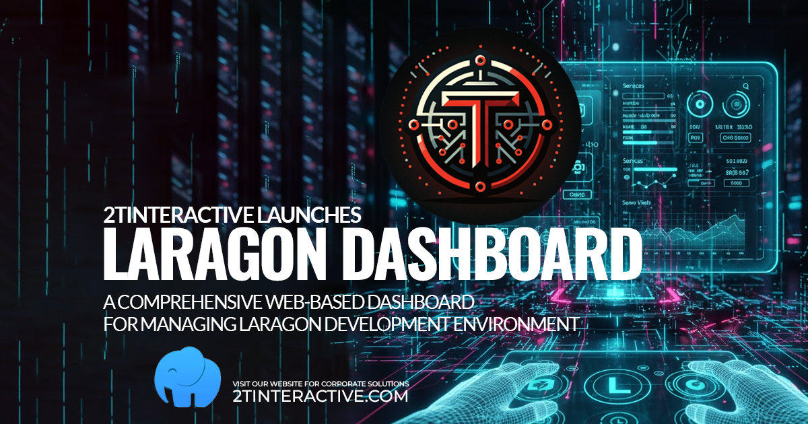

# 🚀 Laragon Dashboard

A modern, feature-rich web-based dashboard for managing local development environments. Born on Windows, now evolved for Linux through [Nucleus](https://github.com/LebToki/Nucleus).

Version 4.0.7 — the latest Windows release with cross-platform enhancements. The journey continues on Linux.

---

## 📖 The Story

Laragon Dashboard started as a passion project in 2023 — a modern web interface to replace Laragon's native control panel on Windows. It grew into a comprehensive MAMP competitor with service management, database browsing, project discovery, email management, server monitoring, and even an AI-powered code editor plugin.

**Then I moved to Linux.**

Rather than abandon this project, I built [**Nucleus**](https://github.com/LebToki/Nucleus) — the spiritual successor. Nucleus takes everything learned from Laragon Dashboard and rebuilds it from the ground up for Linux (ZorinOS, Ubuntu, Mint) using systemd, native service management, and a modular architecture.

**This repository remains the canonical Windows release.** All future development happens in Nucleus. If you're on Windows, this is still your dashboard. If you're on Linux, Nucleus is waiting.

---

## 🎯 v4.0.7 New Features (Ported from Nucleus)

This release brings Nucleus-inspired features to Laragon Dashboard:

- **Cross-Platform Service Management** — Manage Apache, MySQL, Nginx, Redis, and more on both Windows and Linux
- **Per-Project Profiles** — Configure `.nucleus/profile.json` per project with web engine, PHP version, database, cache, and SSL settings
- **Self-Signed SSL** — Generate SSL certificates per project for local HTTPS development
- **Tunnel Integration** — Expose local projects to the internet using LocalTunnel, Cloudflare, or ngrok
- **Enhanced Nginx Support** — Full Nginx service management on Linux

---

## 🖥️ Platform Support

| Platform | Status | Project |
|----------|--------|---------|
| **Windows** | ✅ Fully supported | This repo (Laragon Dashboard) |
| **Linux** | ✅ Native | [Nucleus](https://github.com/LebToki/Nucleus) — the spiritual successor |
| **macOS** | 🔜 Beta interest? | [Open an issue](https://github.com/LebToki/Laragon-Dashboard/issues) if you'd like to beta-test a macOS port |

> **macOS users:** If there's enough interest from beta-testers, we'll port Nucleus's architecture to macOS. The modular design (systemd → launchd, native service bridges) makes this feasible. Drop a comment on the issues page if you're interested.

---

[](https://github.com/LebToki/Laragon-Dashboard)
[](https://php.net)
[](https://getbootstrap.com)
[]()
[](https://github.com/LebToki/Nucleus)
[](LICENSE)
[](https://github.com/LebToki/Laragon-Dashboard)

<p align="center">
  
  
  
</p>



---

## ✨ Screenshots


---

## 🔮 Look to Nucleus

[Nucleus](https://github.com/LebToki/Nucleus) is the Linux-native evolution of Laragon Dashboard. It's built from the ground up for Linux environments and addresses architectural limitations found in the Windows version.

**Key improvements in Nucleus:**

- **systemd-native service management** — no Windows `sc` command hacks, proper Linux service control
- **Modular architecture** — core logic decoupled from UI, easier to patch and extend
- **Improved authentication** — robust local/remote access differentiation
- **Real process management** — proper PID tracking, signal handling, graceful shutdowns
- **No Electron bloat** — pure web technology, zero memory overhead (same philosophy, Linux-native execution)

**If you're a contributor or fork maintainer:** I highly recommend studying Nucleus's approach and adapting its refinements back to Laragon Dashboard. The architectural patterns are transferable.

---

## 📋 Project Information

- **Project Name**: Laragon Dashboard
- **Version**: 4.0.7
- **Author**: Tarek Tarabichi
- **Company**: 2TInteractive (2tinteractive.com)
- **Project Start**: Mid 2023 / Evolved Early 2024
- **GitHub**: https://github.com/LebToki/Laragon-Dashboard
- **Linux Successor**: https://github.com/LebToki/Nucleus
- **License**: MIT
- **Goal**: MAMP competitor for Windows OS → evolved into cross-platform dev environment management

---

## 💡 Why This Matters

Laragon has always been the fastest, most lightweight development environment for Windows. This dashboard brings that same philosophy to the web interface:

- **No Electron bloat** — Pure web technology, zero memory overhead
- **Instant Startup** — Access your dashboard immediately via localhost
- **Seamless Auth** — Local Auto-Authorization pre-authorizes sessions from `127.0.0.1`
- **Integrated Environment** — Direct bridge between web UI and Laragon services
- **Native feel** — WebSocket updates make it feel like a desktop app
- **Extensible** — Plugin system for custom tools and integrations

---

## ✨ Features

### 🎛️ Service Management
- Start/Stop/Restart services — Apache, MySQL, Nginx, Redis, Memcached, MongoDB, PostgreSQL, Mailpit
- Real-time status monitoring and port detection (Windows `net/sc/query` / Linux `systemctl`)
- Automatic service version detection
- Cross-platform service control (Windows + Linux)
- Process-based services support (Nginx, Mailpit)
- **v4.0.7:** Per-project profile configuration via `.nucleus/profile.json`
- **v4.0.7:** Self-signed SSL certificate generation per project

### 📁 Project Management
- Automatic project discovery from `www` directory
- Framework detection — WordPress, Laravel, Drupal, CodeIgniter, Symfony, CakePHP, Joomla
- Search/filter, quick access links, framework-specific icons
- Project actions menu with ignore functionality
- Smart WP Admin button (auto-hides for non-WordPress projects)

### 🗄️ Database Management
- Universal database browser with real-time size calculations
- Table explorer with schema viewer, row counts, indices, constraints
- Safe SQL query runner (read-only mode)
- Engine & collation tracking

### 📧 Email Management (Mailpit)
- Integrated email viewer for Laragon's sendmail output
- Raw log to HTML transformation with searchable, color-coded tables
- Mailpit sync for real-time local email monitoring
- Email statistics and bulk operations

### 📊 Server Monitoring
- Real-time CPU, memory, and disk usage charts
- PHP memory tracking
- Multi-drive support
- Interactive Chart.js visualizations

### 📋 Log Viewer
- Multi-log support (Apache, PHP, MySQL, Dashboard)
- Configurable display (10-1000 lines)
- One-click log clearing
- Terminal-style display

### 🛠️ Quick Tools
- Cache management, database optimization
- Git integration, Composer/NPM commands
- PHP info viewer
- SMTP configuration fix (auto-configure PHP for Mailpit)
- **v4.0.7:** Tunnel integration (LocalTunnel, Cloudflare, ngrok)

### 💾 Backup & Export
- Full project backup with database
- Configurable options (include/exclude vendor, cache)
- Recent backups list with download
- ZIP compression

### 🔄 Update Management
- GitHub-integrated update checks
- Real-time download/install progress
- Automated backup before updates

### 🤖 AI Integration (Beta)
- BYOK AI Agent — glassmorphic chat widget for scaffolding, troubleshooting, code assistance
- System context bridge for real-time environment data

### 🔌 Plugin System (4.0.4+)
- **CodePilot** — AI-powered code editor with multi-provider support (Ollama, DeepSeek, Gemini, OpenAI, Anthropic, etc.)
- Monaco Editor (VS Code engine), full file browser
- One-click install from GitHub
- Auto-updates, enable/disable toggles

### 🔒 Security
- CSRF protection, security headers, rate limiting
- Input sanitization, secure sessions
- Content Security Policy, SQL injection protection

### 🌍 Multi-language Support
- 10 languages — English, German, Spanish, French, Dansk, Norwegian, Indonesian, Portuguese, Tagalog, Arabic

---

## 🛠️ Installation

### Prerequisites
- **Laragon** development environment installed
- PHP 7.4+ with extensions: `json`, `mbstring`, `openssl`, `pdo_mysql`
- MySQL/MariaDB server
- Web server (Apache/Nginx)

### Quick Setup

#### Option 1: Download ZIP (Recommended)
1. Download from [Releases page](https://github.com/LebToki/Laragon-Dashboard/releases)
2. Extract to `C:\laragon\www\Laragon-Dashboard\`
3. Edit `C:\laragon\www\index.php`:
   ```php
   <?php
   header('Location: /Laragon-Dashboard/');
   exit;
   ?>
   ```
4. Access at `http://localhost/`

#### Option 2: Git Clone
```bash
git clone https://github.com/LebToki/Laragon-Dashboard.git
move Laragon-Dashboard C:\laragon\www\Laragon-Dashboard
```

### Configuration
The dashboard auto-detects Laragon paths. Edit `config.php` to customize:
```php
$LARAGON_ROOT = getLaragonRoot();          // Auto-detect
MYSQL_HOST = 'localhost';
MYSQL_USER = 'root';
MYSQL_PASSWORD = '';
APP_NAME = 'Laragon Dashboard';
APP_DEBUG = false;                         // Disabled by default
APP_ENV = 'production';
```

---

## 📁 Project Structure

```
Laragon-Dashboard/
├── api/                    # API endpoints (services, databases, vitals, logs, tools, backup, update, mailpit)
├── assets/                 # CSS, JS, images, fonts
├── i18n/                   # Internationalization (8 languages)
├── includes/               # Router, UpdateManager, AdminerModule, ConfigMigrator, helpers
├── pages/                  # Page templates (dashboard, projects, services, databases, mailbox, vitals, logs, tools)
├── partials/               # Layout partials (layouts, head, sidebar, navbar, footer, scripts)
├── devfiles/               # Knowledge base, testing checklist, dev docs
├── config.php              # Main configuration
├── index.php               # Entry point and router
└── README.md               # This file
```

---

## 🎯 Usage

- **Dashboard** — Server info, project list, framework detection, quick access
- **Services** — Start/stop/restart, real-time status, port monitoring
- **Projects** — Browse, search, filter, framework detection, admin links
- **Databases** — Browse, explore tables, run SELECT queries, optimize
- **Mailbox** — Email stats, search, read, delete, export
- **Server Vitals** — CPU/memory/disk charts, PHP memory tracking
- **Logs** — Multi-log viewer, configurable lines, clear logs
- **Tools** — Cache, database optimization, Git, Composer, NPM, PHP info

---

## 🔌 API Endpoints

```
# Services
GET  /api/services.php?action=status
GET  /api/services.php?action=start&service=Apache
POST /api/services.php?action=stop&service=MySQL

# Databases
GET  /api/databases.php?action=list_databases
GET  /api/databases.php?action=get_tables&database=dbname
POST /api/databases.php?action=execute_query

# Server Vitals
GET  /api/vitals.php

# Logs
GET  /api/logs.php?action=list_logs
GET  /api/logs.php?action=read_log&path=logpath&lines=100

# Tools
POST /api/tools.php (actions: clear_cache, optimize_database, composer_command, npm_command, git_status)
GET  /api/tools.php?action=php_info

# Backup
GET  /api/backup.php?action=list
POST /api/backup.php?action=create

# Update
GET  /api/update.php?action=check
POST /api/update.php?action=download&install
```

---

## 🚀 Production Deployment

### Security Configuration
```php
// config.php
define('AUTH_ENABLED', true);
define('ADMIN_PASSWORD', getenv('LARAGON_DASHBOARD_PASSWORD') ?: 'YourStrongPassword123!');
define('APP_DEBUG', false);
define('APP_ENV', 'production');
define('SECURITY_HEADERS_ENABLED', true);
```

### Environment Variables
| Variable | Description | Default |
|----------|-------------|---------|
| `LARAGON_DASHBOARD_PASSWORD` | Admin password | (must be set) |
| `LARAGON_ROOT` | Laragon installation path | Auto-detected |

---

## 🐛 Troubleshooting

### Diagnostic Tool
Access `http://localhost/Laragon-Dashboard/diagnostic.php` for:
- Server configuration and paths
- Laragon detection status
- File system checks
- Asset path verification

### Common Issues
- **404 Errors** — Run diagnostic tool, verify Apache document root
- **CSS/JS not loading** — Check browser console, verify `ASSETS_URL`, clear cache
- **Laragon not detected** — Use diagnostic tool, manually set path in Preferences
- **Email not loading** — Check `SENDMAIL_OUTPUT_DIR` path
- **Database issues** — Verify MySQL credentials, ensure service running

---

## 🤝 Contributing

Contributions welcome! See [CONTRIBUTING.md](CONTRIBUTING.md).

**For Windows fixes:** PRs against this repo are welcome.
**For new features:** Consider contributing to [Nucleus](https://github.com/LebToki/Nucleus) instead — that's where active development happens.

---

## 📄 License

MIT License — see [LICENSE](LICENSE).

## 🙏 Acknowledgments

- **Laragon Team** — For the excellent development environment
- **Bootstrap Team** — For the amazing CSS framework
- **Chart.js Team** — For the beautiful charting library
- **All contributors** — Thank you for making this project what it is

---

## 📞 Support

- **Documentation**: This README + [Knowledge Base](devfiles/KNOWLEDGE_BASE.md)
- **Issues**: [GitHub Issues](https://github.com/LebToki/Laragon-Dashboard/issues)
- **Discussions**: [GitHub Discussions](https://github.com/LebToki/Laragon-Dashboard/discussions)
- **Linux version**: [Nucleus](https://github.com/LebToki/Nucleus)

---

## 🔄 Changelog

See [CHANGELOG.md](CHANGELOG.md) for detailed version history.

### [4.0.5] - 2026-03-17
- 50+ PRs merged (testing, optimization, security fixes)
- Path traversal fix in Backup API (critical)
- Missing authentication fix in Update API
- File encoding fixes + PHPUnit migration
- Git pull support in update manager
- CodePilot plugin installation support
- Ignored projects state persistence
- Comprehensive test coverage additions

---

**Made with ❤️ for the Laragon community**

**Author**: Tarek Tarabichi | **Company**: 2TInteractive | **Website**: https://2tinteractive.com

---

## ☕ Support the Project

[](https://buymeacoffee.com/LebToki)
[](https://www.paypal.com/donate/?hosted_button_id=TEEJNYQJA9B6U)

---

## 💼 Professional Services

**2TInteractive** offers custom development, premium dashboard solutions, and consulting services.

**Visit**: https://2tinteractive.com

---

*This dashboard is open-source and free to use. For enterprise features, custom integrations, or professional support, consider our premium services.*
